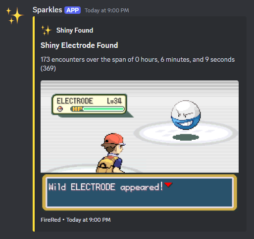

# Frame Hunter
A python program for mGBA that starts an encounter for every frame  
# Features
## Encountering
The way this all works is: the program pauses the game, advances one frame, creates a save state, encounters the Pokémon, if it's not shiny it reloads the save state, and restarts the loop. In the GBA Pokémon games, RNG is tied to the frame rate. Through this method, the program effectively encounters every version of this Pokémon, in order. Along with frame-by-frame encountering Pokémon, this program also utilizes mGBA's speed up feature to encounter even more Pokémon in less the time. I've gotten as low as **one second** per encounter.  
## Logging
Tracks and saves the total encounters and elapsed time to `resets.json`.  
## Shiny Detection
The shiny detection is pretty simple, by choosing a color from the non-shiny variant that doesn't appear on the shiny variant, the program can tell if an encounter is shiny. The program simply checks if a specific pixel is a certain color, if it is that color, then it's not shiny. But if it isn't that color, then you found a shiny!  
## Discord Notifying
Through the use of a discord webhook, the program will notify you when it finds a shiny.  
  
# Showcase
PUT A VID HERE  
# Setup
Most of the setup is very easy, the hardest part is setting up the bounding boxes and stuff  
## Getting Positions
### Game Screen
**Step 1.** Take a screenshot of your whole screen.  
**Step 2.** Open the screenshot in an image editing software, I use [paint.net](https://www.getpaint.net/).  
**Step 3.** Determine how many pixels each side of the actualy game window is away from 0. For example: the left side of my game is 183 pixels from the left of the screen and the right side is 1737 from the left of the screen. The top of my game is 44 pixels away from the top of my screen and the bottom of my game is 1078 pixels from the top of my screen. (I hope that all made sense)  
**Step 4.** Take the 4 numbers you got and enter them into `"game_screen": []` which is under `"bounding_boxes"` in `settings.json`. For reference this is what mine looks like: `"game_screen": [183, 44, 1737, 1078]`  
### Encounter
**Step 1.** Encounter the Pokémon you're going to be having the program shiny hunt for.  
**Step 2.** Take a screenshot of your whole screen, and then once again open it in an image editing software.  
**Step 3.** Pick a specific pixel on the Pokémon's sprite that only appears on the non-shiny variant. For example: I'm doing Electrode so I picked one of the red pixels because all of the red pixels turn blue for the shiny variant.  
**Step 4.** Determine how far the pixel is from the left side and top of the screen. For example: the pixel I chose is 1327 pixels from the left of the screen and 417 pixels from the top of the screen.  
**Step 5.** Take those 2 numbers you got and enter them into `"encounter": []` which is under `"bounding_boxes"` in `settings.json`. For reference this is what mine looks like: `"encounter": [1327, 417]`  
**Step 6.** Go back to the image editing software and get the RGB values of the pixel you chose.  
**Step 7.** Take those 3 numbers you got and enter them into the other `"encounter": []` which is under `"colors"` in `settings.json`. For reference this is what mine looks like: `"encounter": [231, 66, 0]`  
### Name Plate
**Step 1.** You can reuse the screenshot from the last part, otherwise, encounter the Pokémon and wait for all the UI to show up, then screenshot your whole screen.  
**Step 2.** Open in image editing software, you get it by this point.  
**Step 3.** Pick a pixel on the right most side of the Pokémon's name plate. We do this because when the Pokémon is first encountered, its colors are dulled. By the time the name plate is all the way on screen, the Pokémon is at normal brightness. That's why we pick the right most side of the name plate.  
**Step 4.** Repeat steps 4-7 from the last part except enter the values into `"name_plate": []` instead of `"encounter": []`.  
## Settings
The names for each setting is pretty self explanatory so I won't address each one, maybe that's just me being lazy but I have faith that you can figure it out.  
# Usage
## `main.py`
First, position yourself in front of the static encounter, then you can run this program. When this program starts there will be a 3 second countdown before it starts sending inputs. In that 3 seconds, make sure you've focused on the game so that the inputs will connect. And that's pretty much all there is to it, now you just watch.  